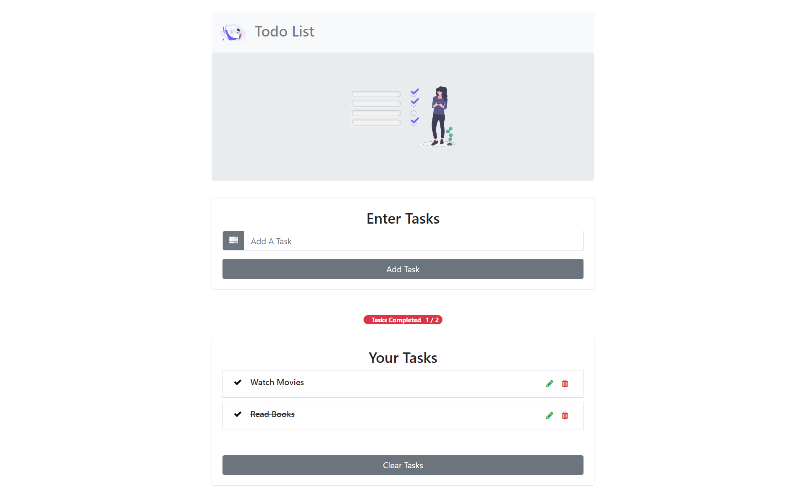

# React To-Do List

This is a simple and small To-Do list app built using React. Todo Items are generated and rendered to the DOM once it is submitted through the form. They can be updated to show whether they are completed or not. In addition, the user can delete an item from the todo list or they can delete the entire todo list, removing it from the cloud firestore and from the project's State.

All the tasks are saved in the cloud firestore. This app shows all the CRUD (Create, read, update and delete) operations. 

## Screenshot



## Live Demo

https://todo-list-db771.web.app/

## Features
* Add new task 
* Mark task as completed / uncompleted
* Edit existing task
* Delete existing task

## Technologies Used
* React JS 
* Reactstrap
* Firebase Firestore

## Start Project

First clone this repository.

```sh
$ git clone https://github.com/SayanSahu99/todo-list-react.git
```

Install all the dependencies. You must have [`nodejs`](https://nodejs.org/en/) & [`npm`](https://www.npmjs.com/) installed in your system.

```sh
$ npm install # or yarn
```

Create a .env file with the following environment variables related to firebase credentials:
```sh
REACT_APP_API_KEY= <your-api-key>
REACT_APP_AUTH_DOMAIN= <your-auth-domain>
REACT_APP_DATABASE_URL= <your-database-url>
REACT_APP_PROJECT_ID= <your-project-id>
REACT_APP_STORAGE_BUCKET= <your-storage-bucket-url>
REACT_APP_MESSEAGING_SENDER_ID= <your-Messaging-Sender-id>
REACT_APP_APP_ID= <your-App-id>
REACT_APP_MEARSUREMENT_ID= <your-measurement-id>
```

Run the app

```sh
npm start # or yarn
```
## Future Improvements
Currently this project doesn't have firebase-auth, so all the users can see and edit the todos of each other :sweat_smile:.

## License
Released under the [MIT](https://opensource.org/licenses/mit-license.php) license.


This project was bootstrapped with [Create React App](https://github.com/facebook/create-react-app).

## Available Scripts

In the project directory, you can run:

### `npm start`

Runs the app in the development mode.<br />
Open [http://localhost:3000](http://localhost:3000) to view it in the browser.

The page will reload if you make edits.<br />
You will also see any lint errors in the console.

### `npm test`

Launches the test runner in the interactive watch mode.<br />
See the section about [running tests](https://facebook.github.io/create-react-app/docs/running-tests) for more information.

### `npm run build`

Builds the app for production to the `build` folder.<br />
It correctly bundles React in production mode and optimizes the build for the best performance.

The build is minified and the filenames include the hashes.<br />
Your app is ready to be deployed!

See the section about [deployment](https://facebook.github.io/create-react-app/docs/deployment) for more information.

### `npm run eject`

**Note: this is a one-way operation. Once you `eject`, you can’t go back!**

If you aren’t satisfied with the build tool and configuration choices, you can `eject` at any time. This command will remove the single build dependency from your project.

Instead, it will copy all the configuration files and the transitive dependencies (webpack, Babel, ESLint, etc) right into your project so you have full control over them. All of the commands except `eject` will still work, but they will point to the copied scripts so you can tweak them. At this point you’re on your own.

You don’t have to ever use `eject`. The curated feature set is suitable for small and middle deployments, and you shouldn’t feel obligated to use this feature. However we understand that this tool wouldn’t be useful if you couldn’t customize it when you are ready for it.

## Learn More

You can learn more in the [Create React App documentation](https://facebook.github.io/create-react-app/docs/getting-started).

To learn React, check out the [React documentation](https://reactjs.org/).

### Code Splitting

This section has moved here: https://facebook.github.io/create-react-app/docs/code-splitting

### Analyzing the Bundle Size

This section has moved here: https://facebook.github.io/create-react-app/docs/analyzing-the-bundle-size

### Making a Progressive Web App

This section has moved here: https://facebook.github.io/create-react-app/docs/making-a-progressive-web-app

### Advanced Configuration

This section has moved here: https://facebook.github.io/create-react-app/docs/advanced-configuration

### Deployment

This section has moved here: https://facebook.github.io/create-react-app/docs/deployment

### `npm run build` fails to minify

This section has moved here: https://facebook.github.io/create-react-app/docs/troubleshooting#npm-run-build-fails-to-minify
